<div align="center">

# 고찌봄 Frontend

### 어르신은 사진 한 장, 보호자는 실시간 안심

고찌봄 FE는 **어르신용 복약 확인 화면**과 **보호자·복지사용 모니터링 화면**을 하나의 React SPA 안에서 제공하는 웹앱입니다.
Firebase Hosting으로 배포되며, 백엔드가 준비되지 않아도 데모 데이터를 통해 주요 시연 흐름을 확인할 수 있습니다.

<br />

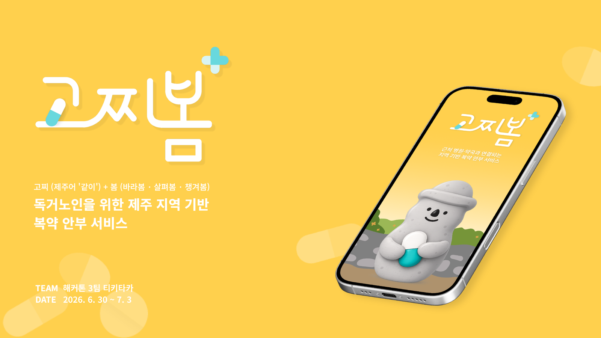

<br />
<br />

[](https://react.dev/)
[](https://www.typescriptlang.org/)
[](https://vite.dev/)
[](https://firebase.google.com/)

</div>

---

## 🔗 Links

| 구분 | 링크 |
| --- | --- |
| Live Demo | https://gojjibom.web.app/ |
| Frontend Repository | https://github.com/TIKI-TAKA-hackathon/Tiki-Taka-FE |
| Backend Repository | https://github.com/TIKI-TAKA-hackathon/Tiki-Taka-BE |

---

## 🧡 Service Summary

고찌봄은 약국이 등록한 복약 정보를 바탕으로 어르신의 복약 여부를 가족·요양보호사·복지사에게 연결하는 **복약 안부 서비스**입니다.

어르신에게는 복잡한 입력을 요구하지 않습니다.
복약 시간이 되면 큰 버튼을 누르고, 먹은 약 포지 사진을 촬영하면 복용 기록이 끝납니다.

<p align="center">
  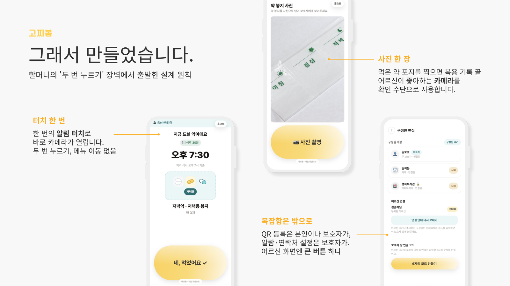
</p>

---

## 🍊 Why Gojjibom?

<p align="center">
  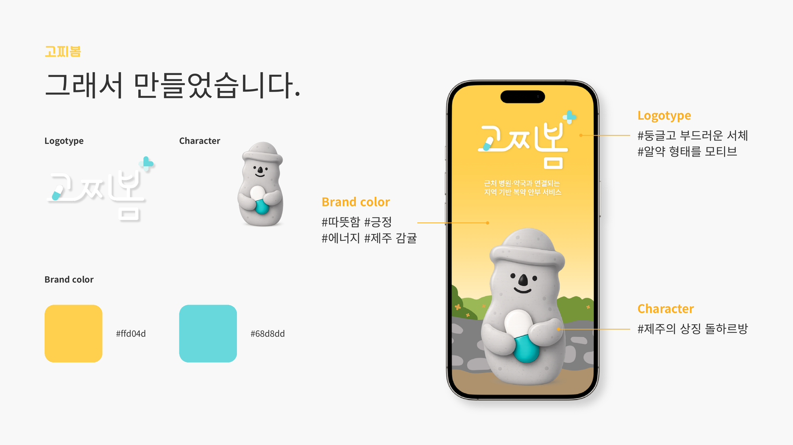
</p>

**고찌봄**은 제주어 `고찌(같이)`와 `봄(바라봄 · 살펴봄 · 챙겨봄)`을 합친 이름입니다.

혼자 약을 챙겨야 하는 시간을 보호자와 돌봄 인력이 **같이 보는 안부 신호**로 바꾸겠다는 의미를 담았습니다.

그래서 고찌봄의 화면은 어르신에게 복잡한 관리 앱이 아니라, 알림을 누르고 약 포지를 찍으면 가족에게 안부가 전해지는 단순한 경험을 목표로 합니다.

브랜드는 제주 감귤의 따뜻한 색감과 돌하르방 캐릭터를 사용해 복약 관리 서비스가 줄 수 있는 차가운 느낌을 낮추고, “챙김”과 “안심”의 인상을 먼저 전달하도록 설계했습니다.

---

## ✨ Key Features

| 사용자 | 기능 | 설명 |
| --- | --- | --- |
| 어르신 | 오늘 먹을 약 확인 | 복용 시간, 식전·식후 기준, 약 개수를 큰 화면으로 안내합니다. |
| 어르신 | 복약 알림 | 잠금화면형 알림과 인앱 알림에서 바로 복약 확인 화면으로 진입합니다. |
| 어르신 | 처방 QR 등록 | 약국에서 받은 처방 QR을 촬영해 복약 일정과 알림을 등록합니다. |
| 어르신 | 약 포지 사진 촬영 | 먹은 약 포지를 촬영해 보호자가 확인할 수 있는 기록을 남깁니다. |
| 보호자·복지사 | 보호자 화면 | 어르신 등록, 연결 코드 발급, 식사 시간과 알림 설정을 진행합니다. |
| 보호자·복지사 | 복약 대시보드 | 오늘 복약 상태, 최근 7일 기록, 확인 필요 상태를 확인합니다. |
| 보호자·복지사 | 사진·알림 확인 | 복용 완료, 미확인, 에스컬레이션, 복약 사진 기록을 확인합니다. |
| 데모 | Mock fallback | API 실패 또는 데모 모드에서 fixture 데이터로 시연 흐름을 유지합니다. |

---

## 🧭 User Flow

<p align="center">
  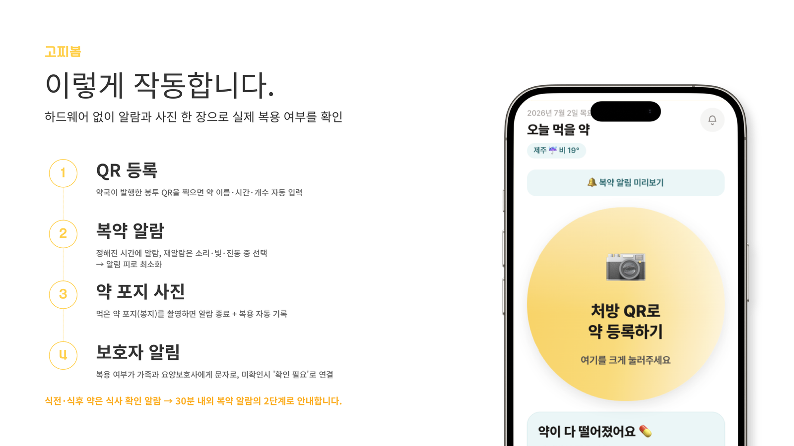
</p>

### 어르신 플로우

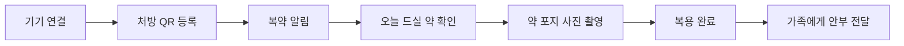

### 보호자·복지사 플로우

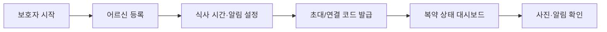

### 실제 서비스 화면 흐름

아래 GIF는 현재 FE 라우트에서 직접 실행한 화면 흐름입니다.
사이트에 접속하지 않아도 어르신과 보호자가 어떤 순서로 서비스를 사용하는지 확인할 수 있습니다.

<table>
  <tr>
    <td width="50%" align="center">
      <strong>어르신 복약 확인</strong><br />
      알림을 누르고 복용할 약을 확인한 뒤 사진을 보내 완료합니다.<br /><br />
      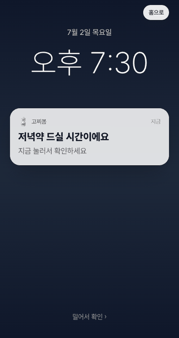
    </td>
    <td width="50%" align="center">
      <strong>사진 재확인 및 보호자 연결</strong><br />
      사진이 헷갈릴 때 다시 촬영을 반복하면 대표 보호자 연락으로 이어집니다.<br /><br />
      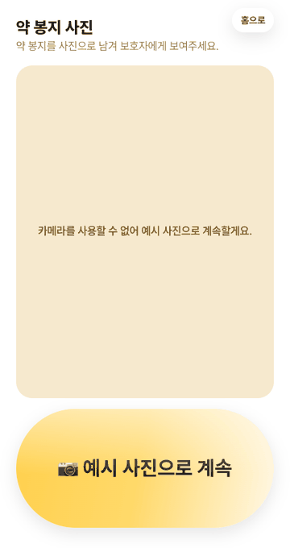
    </td>
  </tr>
  <tr>
    <td width="50%" align="center">
      <strong>처방 QR 등록</strong><br />
      약국 처방 QR을 읽고 병원, 약, 알림 시간을 순서대로 확인합니다.<br /><br />
      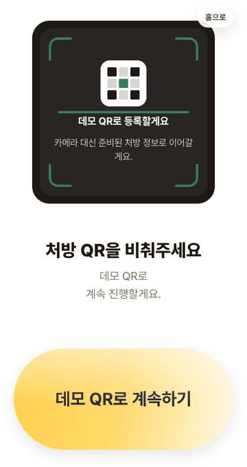
    </td>
    <td width="50%" align="center">
      <strong>보호자 복약 모니터링</strong><br />
      보호자 대시보드에서 복약 상태와 사진 기록을 확인하고 재요청할 수 있습니다.<br /><br />
      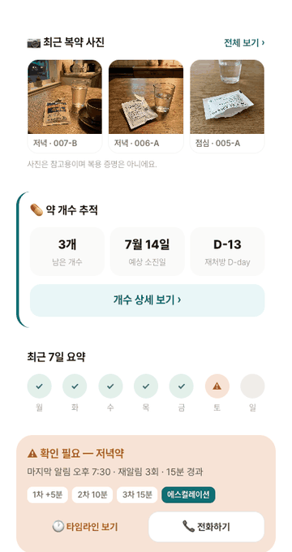
    </td>
  </tr>
  <tr>
    <td colspan="2" align="center">
      <strong>데모 알림 미리보기</strong><br />
      보호자 알림 카드에서 복용 완료, 미확인, 날씨 안내가 어떻게 이어지는지 보여줍니다.<br /><br />
      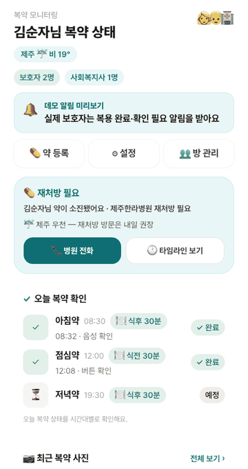
    </td>
  </tr>
</table>

---

## 🖥️ Main Screens

<p align="center">
  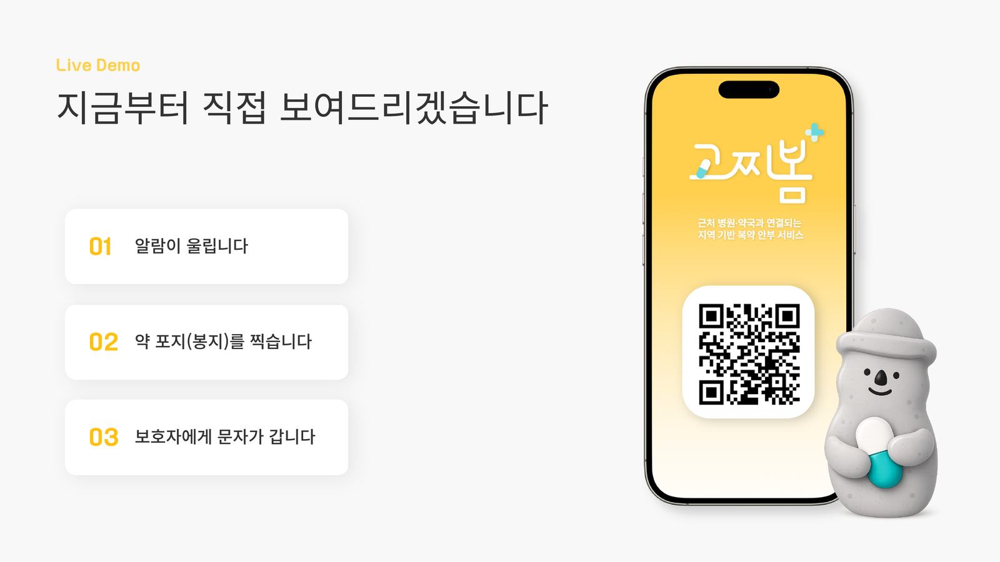
</p>

| 화면 | 경로 | 설명 |
| --- | --- | --- |
| 온보딩 | `/onboarding` | 어르신 화면과 보호자 화면 진입점을 제공합니다. |
| 어르신 기기 연결 | `/senior/register` | 보호자가 발급한 연결 코드로 어르신 기기를 연결합니다. |
| 어르신 처방 QR 등록 | `/senior/add-prescription` | 약국에서 받은 처방 QR을 촬영하고 복약 알림을 등록합니다. |
| 복약 알림 | `/senior/notify`, `/senior/dose` | 잠금화면형 알림에서 복약 확인 화면으로 이어집니다. |
| 약 상세 | `/senior/dose` | 복용해야 할 약, 개수, 식전·식후 기준을 안내합니다. |
| 카메라 | `/senior/camera` | 약 포지 사진을 촬영합니다. |
| 완료 | `/senior/done` | 복약 확인 완료와 가족 알림을 보여줍니다. |
| 오늘 복약 홈 | `/senior/today` | 오늘의 복약 일정과 재처방 정보를 보여줍니다. |
| 보호자 시작 | `/caregiver/signup` | 보호자 정보와 어르신 정보를 등록합니다. |
| 보호자 대시보드 | `/caregiver` | 어르신의 복약 상태, 확인 필요, 최근 기록을 확인합니다. |
| 보호자 약 등록 | `/caregiver/add-prescription` | 보호자 화면에서 처방 QR 또는 코드를 등록합니다. |
| 구성원 관리 | `/caregiver/manage` | 가족·복지사·요양보호사 참여자를 관리합니다. |
| 알림 설정 | `/caregiver/settings` | 식사 시간과 복약 재알림 설정을 관리합니다. |
| 약 개수 추적 | `/caregiver/pills` | 남은 약, 예상 소진일, 재처방 D-day를 확인합니다. |
| 복약 사진 | `/caregiver/photos` | 어르신이 촬영한 약 포지 사진을 확인합니다. |
| 타임라인 | `/caregiver/timeline` | 복약 확인과 알림 기록을 시간순으로 확인합니다. |

---

## 🛠️ Tech Stack

| 영역 | 기술 |
| --- | --- |
| Framework | React 19, Vite |
| Language | TypeScript |
| Routing | React Router |
| Styling | Tailwind CSS, Global CSS |
| Test | Vitest, Testing Library |
| Deploy | Firebase Hosting |
| Quality Gate | ESLint, TypeScript check, Test, Build |

---

## 📁 Project Structure

```text
.
├── docs/assets/             # README용 이미지 asset
├── public/
├── src/
│   ├── components/          # 공용 UI, AppLayout, 버튼·카드·배지
│   ├── lib/                 # api.ts, types.ts, mock.ts, env.ts, session helpers
│   ├── routes/
│   │   ├── senior/          # 어르신 온보딩·알림·QR 등록·복약확인·카메라·완료·홈
│   │   └── caregiver/       # 보호자 등록·대시보드·설정·구성원·사진·타임라인
│   └── styles/
├── specs/                   # 구현 스펙과 실서비스화 계획
├── .github/workflows/       # Firebase Hosting 배포 workflow
├── firebase.json
├── package.json
└── vite.config.ts
```

---

## ⚙️ Environment

`.env.example`을 복사해 `.env`를 생성합니다.

```bash
cp .env.example .env
```

```env
VITE_API_BASE_URL=<backend-api-origin>
VITE_FRONTEND_BASE_URL=https://gojjibom.web.app
VITE_DEMO_MODE=false
```

| 변수 | 설명 |
| --- | --- |
| `VITE_API_BASE_URL` | 백엔드 API 서버 origin입니다. FE 내부에서 `/api/v1` prefix를 붙여 호출합니다. |
| `VITE_FRONTEND_BASE_URL` | Firebase Hosting 주소입니다. |
| `VITE_DEMO_MODE` | `true`이면 API 호출 없이 mock 데이터로 시연합니다. `false`여도 API 실패 시 fixture로 fallback합니다. |

---

## 🚀 Local Development

```bash
npm install
npm run dev
```

기본 개발 서버는 `http://localhost:5173` 입니다.

---

## ✅ Quality Gate

```bash
npm run lint
npm run typecheck
npm test
npm run build
```

CI/CD에서는 위 검증을 통과한 뒤 Firebase Hosting으로 배포합니다.

---

## 🔌 Backend Contract

FE는 `src/lib/api.ts`를 통해 백엔드와 통신합니다. 모든 백엔드 응답은 공통 envelope 형태를 기대합니다.

```json
{
  "data": {},
  "error": null
}
```

대표 API 연결은 다음 흐름을 중심으로 사용합니다.

| 기능 | Method | Endpoint |
| --- | --- | --- |
| 오늘 복약 조회 | GET | `/api/v1/senior/today` |
| 보호자 보드 | GET | `/api/v1/care-groups/{id}/board` |
| 케어그룹 생성 | POST | `/api/v1/care-groups` |
| 초대 링크 생성 | POST | `/api/v1/care-groups/{id}/invite-links` |
| 처방 QR 조회 | GET | `/api/v1/prescriptions:lookup?code=` |
| 식사 시간 조회/수정 | GET/PUT | `/api/v1/seniors/{id}/meal-times` |
| 알림 설정 조회/수정 | GET/PUT | `/api/v1/seniors/{id}/notification-settings` |
| 복약 사진 조회 | GET | `/api/v1/care-groups/{id}/photos` |

상세한 백엔드 구현, DB, 서버 배포 내용은 백엔드 저장소와 API 문서를 기준으로 관리합니다.

---

## 🚢 Deployment

Firebase Hosting 배포 기준입니다.

```bash
npm run build
firebase deploy --only hosting
```

GitHub Actions에서는 `main` branch push 또는 `workflow_dispatch`로 배포가 수행됩니다.

---

## ⚠️ MVP Limitation

| 한계 | 현재 처리 |
| --- | --- |
| 앱이 닫힌 상태의 실제 푸시 | 브라우저 로컬 알림 또는 앱 내부 알림 중심으로 시연합니다. |
| 카카오 알림톡/SMS | BE 벤더 연동 이후 실제 발송으로 확장합니다. |
| 사진 저장 | 데모에서는 세션/fixture 중심이며, 실서비스에서는 서버 저장소 연동이 필요합니다. |
| 사진 = 복용 100% 보장 아님 | ‘복용 실패’가 아니라 ‘확인 필요’ 상태로 보호자에게 연결합니다. |

---

## 👥 Team

| 이름 | 역할 | 담당 |
| --- | --- | --- |
| 김주영 | 팀장 | 서비스 방향성 검토, 리스크 피드백 |
| 허동현 | PM & Development Lead | FE/BE 개발 총괄, 배포·연동 설계 |
| 박윤아 | Presentation & Research | 발표 준비, 자료조사, 대본 구성 |
| 강지연 | UX/UI Design | 브랜드·화면 디자인 |
| 이재영 | Research & Evidence | 통계 근거 정리, TTS 자료 준비 |
